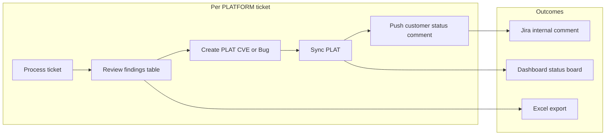
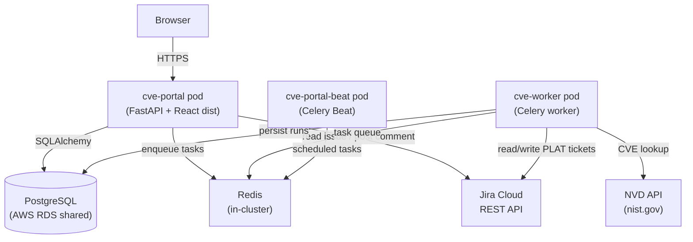
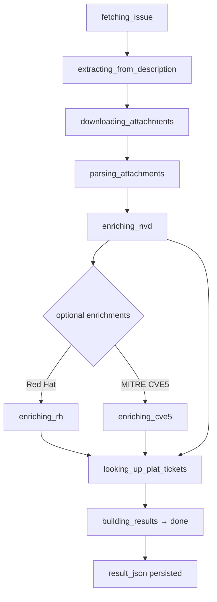

# CVE Portal

| | |
|---|---|
| **Audience** | Product, Engineering, Operations |
| **Status** | Current — v1.2622.1 |
| **Prod URL** | https://cve.ps-cluster.plainid.net |
| **Repo** | Internal `cve_portal` repository |
| **Last updated** | May 2026 |

---

## Executive Summary

The CVE Portal is an internal PlainID tool that ingests Jira PLATFORM security tickets, extracts CVE identifiers from their descriptions and attachments, enriches them with NVD data, and creates and synchronises PLAT "Security Vulnerability" tickets. It gives security and product teams a single place to track remediation progress across all customers, generate customer-ready status communications, and export findings — without touching Jira directly for routine updates.

---

## Contents

1. [Product Manager & Design Perspective](#1-product-manager--design-perspective)
2. [Architecture Perspective](#2-architecture-perspective)
3. [Deployment Perspective](#3-deployment-perspective)

---

## 1. Product Manager & Design Perspective

### 1.1 Problem and Goals

Security tickets arrive in Jira (PLATFORM project) with CVE identifiers scattered across free-text descriptions, PDF reports, and JSON attachments. Before this portal existed, assessing which PLAT remediation tickets existed, what fix versions had been assigned, and which customers were affected required navigating between multiple Jira tickets manually and cross-referencing spreadsheets.

**Goals the portal addresses:**

- Pull all CVEs out of a PLATFORM ticket automatically (description + attachments).
- Enrich each CVE with NVD severity/score data.
- Correlate existing PLAT Security Vulnerability and Bug tickets already in Jira.
- Allow operators to create missing PLAT tickets in bulk.
- Sync fix version and tag number fields back from Jira after engineers update them.
- Produce a customer-ready remediation status table as a Jira internal comment.
- Provide a dashboard that shows where every open security ticket stands without opening each one.

---

### 1.2 Users and Primary Workflows

The portal is used by PlainID's Security/PS team. The main operational loop is:



The UI has three primary surfaces and two admin modals:

| Surface | What it does |
|---------|-------------|
| **Dashboard** | Status board — one row per PLATFORM ticket (latest run). Shows customer name, CVE count, remediation status pill, and last sync time. Search by ticket key, PLAT key, CVE ID, customer name, or pasted Jira URL. Sort by status, last sync, CVE count, or alphabetically. |
| **Process ticket** | Enter a PLATFORM ticket key, kick off the analysis pipeline, and watch live progress. Results appear when done. |
| **Results / Findings** | CVE table with severity, images, linked PLAT tickets, fix version, tag numbers. PLAT create/bulk-create actions. Sync PLAT button with live progress and phase summary. Customer status comment draft and push. Excel export. |
| **Customer SLAs** (admin modal) | Configure per-customer SLA deadlines per severity (e.g. Critical: 14 days, High: 30 days). Deadline is calculated in business days from the PLATFORM ticket creation date. |
| **Allowed images** (admin modal) | Maintain the list of canonical PlainID image basenames. Images not on this list are flagged in the findings table to catch typos or unknown images. |

---

### 1.3 Dashboard Remediation Statuses

Each ticket on the dashboard carries a **remediation status pill** computed from the actual Jira fix/tag data — not just whether PLAT tickets exist. This gives an at-a-glance answer to "how far along is the fix for this customer?"

The status is derived server-side using the same slot model (CVE × image × Security PLAT key) as the customer comment and Excel export, so the dashboard, the Jira comment, and the spreadsheet always agree.

| Status | Color | What it means |
|--------|-------|----------------|
| **Processing** | Blue | Analysis pipeline or PLAT sync is still running. |
| **Error** | Red | Run failed, PLAT sync had errors, or an NVD lookup failed on a CVE. Needs operator attention. |
| **Needs PLAT** | Amber | Pipeline done, but at least one Security CVE PLAT ticket is still missing for an image. Bug tickets are excluded from this check. |
| **Initialized** | Gray | All PLAT CVE tickets exist, but PLAT sync has never been run — no fix version or tag data is available yet. |
| **Waiting for release date** | Orange | Sync has been run; at least one image/CVE slot still has no resolved release date (engineer has not set a fix version with a parseable week code). |
| **Waiting for tags** | Amber | All slots have a PLAT fix version, but tag numbers are still missing on some (release is planned but not yet built/tagged). |
| **Done** | Green | Every slot has tag numbers. The fix version is confirmed and customer-ready. |

**Priority order** (first match wins): Error → Processing → Needs PLAT → Initialized → Waiting for release date → Waiting for tags → Done.

**Row layout** (left-to-right): ticket key + customer name → CVE count → remediation pill → "Last sync: X ago" (hover shows exact timestamp). Daily sync toggle and action buttons (Open, Open in Jira, Remove) are on the right.

**Stats bar** at the top of the dashboard shows a count per bucket across all issues.

---

### 1.4 Findings Table and PLAT Actions

Each row in the findings table represents one CVE. Columns include:

- **CVE ID** — links to NVD
- **Severity / CVSS Score** — from NVD enrichment
- **Affected Image / Tag** — PlainID image the CVE was found in
- **PLAT Security Vulnerability** — linked Jira ticket(s); "Create CVE" button when missing and enough data is available
- **PLAT Bug** — linked bug ticket(s); "Create Bug" button when missing
- **PLAT fix version** — translates the Jira fix version week code (e.g. `5.2627.x`) to a human calendar date (e.g. "June 29, 2026"); may show **In progress** or **N/A** (see legend on the results page)
- **Tag numbers** — the raw release tag from the PLAT ticket after sync; may show **In progress** or **N/A**
- **SLA due date** — calculated from customer SLA configuration

**Status values** — **In progress** and **N/A** in the findings table match the definitions in the comment header. Internally, **N/A** is set when Aqua does not find the package for that image; **In progress** when release/fix fields are not yet available from PLAT sync.

**Bulk actions**: "Create all missing PLAT CVEs" and "Create all missing PLAT Bugs" buttons process all eligible rows without clicking each one individually.

**Sync PLAT**: reads the latest fix version, tag numbers, CVE label, and SLA due date from Jira for all linked Security PLAT tickets, then writes updates back. A modal summary shows how many items were checked and changed per phase after each sync. The portal also auto-links PLAT tickets back to the PLATFORM parent via a "Relates" link.

**Daily automatic sync**: a checkbox on each dashboard row enables Celery Beat to run Sync PLAT automatically every 24 hours for that ticket. No manual action required once enabled.

---

### 1.5 Customer Communication

After syncing, operators push a structured internal comment to the PLATFORM Jira ticket. This comment is the customer-facing status update (kept internal via JSM API).

**Comment columns:**

Six columns are available. The **Columns** picker on the Suggested comment card controls which appear in both the draft textarea and the pushed Jira comment. Choices are saved to `localStorage` and persist across page reloads.

| Column | Key | Notes |
|--------|-----|-------|
| CVE | `cve` | Always included (cannot be hidden) |
| Severity | `severity` | CVSS severity + score |
| Image | `image` | Image basename and release tag (`basename:version`). Aqua ECR transactional tags (`{version}_{Service}_{DDMonYYYY}`) are shown as `basename:version` only (e.g. `authz-sql-pdp-modifier:5.2617.0`); the full tag is still used for Aqua catalog lookups. |
| Package | `package` | Aqua-confirmed name, or "Package not found" / N/A |
| Expected release date | `expectedRelease` | Week-code translated to calendar Monday |
| Fix Version | `fixVersion` | Raw PLAT tag numbers |

When a package is not found in Aqua, Expected release date and Fix Version show **N/A**. Any slot without a vendor fix or release date yet shows **In progress**.

Each generated comment starts with a fixed header (then the data table):

```
CVE Status Report - <date>

Note: The "Expected Release Date" is an estimate and may be subject to change.

Status definitions:
- In progress: CVE is under evaluation or no vendor fix is available yet
- N/A: Package not present in this image
```

`<date>` is the report build date (locale US English, e.g. `May 27, 2026`). The block is editable in the draft textarea before push.

A hidden HTML marker (`<!-- CVE-Portal-Customer-Status v1 -->`) allows the portal to detect and update the same comment on subsequent pushes (upsert, not duplicate). The marker is always present regardless of column selection.

**Jira rendering:** The portal draft shows a plain-text pipe table for editing. When pushed to Jira, the table is converted to a native **ADF table** (`table` / `tableRow` / `tableHeader` / `tableCell` nodes) so Jira renders it with proper column borders and aligned cells. This conversion always uses the REST v3 comment endpoint (`/rest/api/3/issue/{key}/comment`) with the `sd.public.comment` property set to `{"internal": true}` for visibility control — regardless of the `JIRA_USE_JSM_INTERNAL_COMMENTS` setting, which only affects non-table comments.

The comment is posted as an **internal** comment. When `JIRA_USE_JSM_INTERNAL_COMMENTS=true`, the Service Desk API is used for non-table comments. Customer-status comments always use REST v3 with the internal property so the ADF table structure is preserved.

**Excel export** (`↓ Export Excel` button): produces CVE, Severity, Image, Expected release date, and Fix Version in a sheet named "Customer Status" — not affected by the comment column picker.

---

### 1.6 Configuration Reference

Key environment variables (set in `.env` for local, or `values.secret.yaml` / ConfigMap for prod):

| Variable | Default | Purpose |
|----------|---------|---------|
| `JIRA_BASE_URL` | — | Jira Cloud instance URL (e.g. `https://plainid.atlassian.net`) |
| `JIRA_EMAIL` | — | Service account email |
| `JIRA_API_TOKEN` | — | Jira API token |
| `JIRA_USE_JSM_INTERNAL_COMMENTS` | `false` | Post comments via JSM internal API (customer-invisible). Set `true` for PLATFORM/JSM tickets. |
| `JIRA_PLAT_PROJECT_KEY` | `PLAT` | Jira project where Security Vulnerability and Bug tickets are created |
| `JIRA_PLAT_BUG_COMPONENT_NAME` | `Security` | Jira component stamped on new PLAT Bug tickets |
| `JIRA_PLAT_LINK_TO_PARENT_ON_CREATE` | `true` | Auto-create "Relates" link from PLATFORM → PLAT on ticket creation |
| `JIRA_PLAT_PARENT_LINK_TYPE_NAME` | `Relates` | Jira link type name used for the parent relationship |
| `POSTGRES_DSN` | local default | Full PostgreSQL connection string used by the app |
| `REDIS_URL` | `redis://localhost:6379/0` | Redis connection used by Celery |
| `NVD_API_KEY` | none | Optional NVD API key for higher rate limits |
| `REDHAT_ENRICHMENT_ENABLED` | `false` | Enable Red Hat Security API enrichment |
| `CVE5_ENRICHMENT_ENABLED` | `false` | Enable MITRE CVE 5.0 enrichment |
| `PLAINID_IMAGE_PATTERNS` | `agent,pip-operator,...` | Comma-separated substrings that identify a PlainID image |

---

## 2. Architecture Perspective

### 2.1 System Context



All external requests (Jira, NVD) originate from the worker pods — the portal API does direct Jira reads for issue fetching and comment posting, but heavy processing is always offloaded to the worker.

---

### 2.2 Components

| Component | Role | Key source |
|-----------|------|-----------|
| **cve-portal** | FastAPI HTTP API serving the React SPA and all REST endpoints | `api/app/main.py`, `api/Dockerfile` |
| **cve-worker** | Celery worker — runs `process_issue` and `sync_plat_for_run` tasks | `worker/app/tasks.py` |
| **cve-portal-beat** | Celery Beat scheduler — fires `run_due_plat_syncs` every 24 h | `worker/app/celery_app.py` |
| **Redis** | Celery broker and result backend (Bitnami in-cluster) | `infra/helm/cve-portal/values.yaml` |
| **PostgreSQL** | Persistent store for processing runs, SLA rules, allowed images, CVE cache | `api/app/models.py` |

---

### 2.3 Data Model

Five tables in PostgreSQL (defined in `api/app/models.py`):

| Table | Purpose |
|-------|---------|
| `processing_runs` | One row per analysis run. Stores `issue_key`, `status`, Celery task ID, and the full `result_json` (CVE rows, organisations, PLAT sync data). |
| `customer_slas` | Per-customer SLA rules: deadline in natural-language days per severity (Critical/High/Medium/Low). |
| `allowed_images` | Canonical PlainID image basenames with optional aliases. Used to flag unrecognised images in findings. |
| `cves` | NVD cache — severity, CVSS score, state, raw JSON. Avoids repeated NVD API calls. |
| `issue_sync_schedules` | Per-ticket daily auto-sync settings (`daily_sync_enabled`, `last_auto_sync_at`). |

The `result_json` column on `processing_runs` contains the full run output as JSON, including:
- `cve_rows` — one entry per CVE with image correlation, PLAT ticket links, and `plat_security_field_sync` (populated after Sync PLAT)
- `organizations` — customer org names pulled from the PLATFORM ticket
- `_plat_sync_errors` — non-fatal PLAT sync errors (triggers **Error** status on dashboard)
- `_plat_sync_stats` — phase-level counters for the sync summary modal

---

### 2.4 Processing Pipeline (`process_issue`)

When an operator submits a PLATFORM ticket key, the portal creates a `ProcessingRun` record and enqueues a `process_issue` Celery task. The worker proceeds through these phases, writing `status` to the DB after each:



The portal front end polls `GET /api/jobs/{run_id}` every few seconds to display live status.

---

### 2.4.1 Aqua Package Enrichment (`enriching_aqua`)

After NVD enrichment the worker checks each CVE row against **Aqua Security** read-only package catalogs.

**Go CVEs**: when NVD identifies a CVE with `vendor: golang` (any product), the Aqua catalog is searched for the resource `stdlib`. This is the single Aqua resource that covers the entire Go runtime and standard library — individual module paths (`crypto/tls`, `net/http`, …) are sub-packages of `stdlib` in the catalog and do not appear as separate entries. The NVD product name (e.g. `go`) is preserved in `all_packages` for reference but the Aqua lookup always uses `stdlib`.

**UI pick list** (when Aqua has not confirmed the package): the Resource column drop-down always shows three options in order:
1. `aqua — stdlib` (for Go CVEs; a no-match on any other CVE shows `aqua — not found` or an Aqua hint)
2. `customer — <name from ticket>`
3. `nvd — <NVD product name, e.g. go>`

Selecting `stdlib` from the drop-down saves it and re-triggers Aqua matching, which will confirm the resource as found if `stdlib` is present in the cached catalog for that image.

**Cache admin**: the **Aqua packages** toolbar entry shows all cached catalogs per image, configures TTL, and allows manual sync or cache invalidation.

---

### 2.5 PLAT Sync (`sync_plat_for_run`)

Triggered by the "Sync PLAT" button (or automatically by Beat). Runs as a separate Celery task on an existing `done` run:

1. **Read PLAT fields from Jira** — for each Security Vulnerability key **scoped to this PLATFORM ticket** (CVE row × `affected_images` via `plat_security_for_images`, not every PLAT ticket in Jira with the same CVE id), fetch `fixVersions`, workflow **status** (`fields.status.name`), Tag Numbers (`customfield_11210`), Package Name (`customfield_11243`), Package vulnerable version (`customfield_11246`), and Vendor Fix Version (`customfield_11247`) → stored in `plat_security_field_sync` (including `issue_status`). When workflow status is **Invalid**, **PLAT fix version** and **Tag numbers** are stored and shown as **N/A** even if Jira still has fix/tag values. Row-level `affected_version` and `fixed_version` are updated from Jira when those fields have values (vendor fix is never written to Jira by the portal; an offline process maintains vulnerable version).

When **Rewrite Package Name on PLAT during Sync PLAT** is enabled in **Aqua packages** settings:

2. **Prepare rewrite values (portal)** — re-run Aqua catalog matching from the DB cache only (`syncing_plat_rewrite`; no new Aqua API calls). Updates portal package fields used for the rewrite.
3. **Rewrite Package Name in Jira** — `PUT` `customfield_11243` with the portal-resolved name (same rules as **Create PLAT**, including Go → `stdlib` even when Aqua cache did not confirm a hit). Package vulnerable version and vendor fix are never written by sync.

Progress is written to `_plat_sync_progress` during the Jira read phase. An append-only **`_plat_sync_log`** (phase starts/ends, warnings, completion summary) is shown in the findings UI as **Sync activity** and mirrored to worker stdout logs. Stats (`fields_read`, `package_names_rewritten`, `packages_checked`, `packages_updated`) and non-fatal errors (`_plat_sync_errors`) are stored at completion.

---

### 2.6 Remediation Status Derivation

The remediation status on the dashboard is computed on the server at request time from `result_json` — not stored as a separate column. This keeps it always fresh with the latest sync data.

The logic lives in `api/app/cve_row_derived.py` (`derive_ticket_remediation_status`):

1. Collect **slots**: one slot per CVE × image × Security PLAT key, using the same resolution logic as the customer comment table.
2. For each slot: resolve `fix` and `tag` from `plat_security_field_sync` (fallback to legacy `plat_app_fix_versions` / `plat_tag_numbers` for older runs).
3. Compute `expected_release` by translating the fix version week code to a calendar Monday (e.g. `5.2627.x` → "June 29, 2026"). Slot has a date only if a week code is parseable.
4. Apply the priority chain described in section 1.3.

The same slot model and date translation are used in the customer comment builder (`api.ts` `collectCustomerStatusRows`) and the Excel export — so all three surfaces always agree.

**API field**: `GET /api/jobs/cve-status` returns `remediation_status` as a string on each summary. The React client prefers this field and falls back gracefully for cached responses from older API versions.

---

### 2.7 API Surface

All routes are in `api/app/main.py`:

| Group | Method | Path | Purpose |
|-------|--------|------|---------|
| **Health** | GET | `/health` | `{"ok": true}` — liveness/readiness |
| **Config** | GET | `/api/config/client` | Non-secret config for UI (Jira browse URL, etc.) |
| **Issues** | GET | `/api/issues/{key}` | Fetch Jira issue metadata |
| | POST | `/api/issues/{key}/process` | Enqueue a new analysis run |
| | POST | `/api/issues/{key}/comment` | Post free-form comment to Jira |
| | PUT | `/api/issues/{key}/comment/status` | Upsert customer status comment (marker-based) |
| | PATCH | `/api/issues/{key}/sync-schedule` | Enable/disable daily auto-sync |
| **Jobs** | GET | `/api/jobs` | List recent runs |
| | GET | `/api/jobs/cve-status` | Dashboard summary (remediation_status, CVE state per run) |
| | GET | `/api/jobs/{run_id}` | Single run details (status + result_json) |
| | POST | `/api/jobs/{run_id}/sync-plat` | Enqueue PLAT sync for a run |
| | POST | `/api/jobs/{run_id}/cancel` | Cancel in-flight run |
| | PATCH | `/api/jobs/{run_id}/cve-row` | Edit a CVE row field (e.g. affected version) |
| | DELETE | `/api/jobs/issue/{key}` | Delete all runs for an issue key |
| **PLAT** | POST | `/api/plat` | Create Security Vulnerability PLAT ticket |
| | POST | `/api/plat/bug` | Create Bug PLAT ticket |
| **Admin** | GET/POST/PUT/DELETE | `/api/sla/customers` | Customer SLA CRUD |
| | GET | `/api/sla/due-date-preview` | Preview SLA due date for a severity |
| | GET/POST/PUT/DELETE | `/api/allowed-images` | Allowed images CRUD |
| | GET | `/api/about` | Version, dependency, and health info |

---

### 2.8 Frontend Architecture

The frontend is a single-page React 18 + TypeScript app (Vite build):

- **`ui/src/App.tsx`** — all components and pages in one file (Dashboard, Process ticket, Results/findings, Admin modals, navigation). Three top-level pages: `new` (process ticket), `dashboard`.
- **`ui/src/api.ts`** — typed API client, all shared types (`CveRow`, `JobResult`, `IssueCveStatusSummary`), and domain logic: PLAT key resolution, fix/tag normalization, customer comment builder, remediation status helpers, Excel export.

The Vite build output (`dist/`) is baked into the portal Docker image at build time. FastAPI serves it via `StaticFiles` mounted at `/` — there is no separate nginx or CDN.

---

## 3. Deployment Perspective

### 3.1 Environments

| Environment | URL | Auth | Database |
|-------------|-----|------|----------|
| Local dev | http://localhost:8080 | None | Local Postgres (Docker Compose) or shared RDS |
| Production | https://cve.ps-cluster.plainid.net | HTTP basic auth (`admin` / configured password) | Shared AWS RDS (`alexb-persistent-mat-view.…us-east-1.rds.amazonaws.com`) |

Both environments use the same RDS instance by default. Local development requires a `.env` file with Jira credentials and Postgres connection details.

---

### 3.2 Local Development

**Prerequisites**: Docker + Docker Compose, `.env` with Jira credentials.

```bash
# Start all services (portal :8080, worker, redis, optional local postgres)
docker compose build portal worker
docker compose up -d

# Seed the allowed images table on a fresh database
docker compose exec portal python -m api.app.seed_allowed_images

# UI hot-reload during development (optional — uses Vite proxy to localhost:8000)
cd ui && npm install && npm run dev
```

The Compose file defines four services: `portal`, `worker`, `postgres`, and `redis`.

---

### 3.3 Docker Images

Two images are built for production. Both are `linux/amd64` (the EKS cluster is x86_64; local Macs are arm64 so `--platform` must be explicit):

| Image | Build file | What it contains |
|-------|-----------|-----------------|
| `psplainid/cve-portal:$VERSION` | `api/Dockerfile` (2-stage) | Node build stage compiles React → `dist/`; Python stage installs dependencies and bakes `dist/` in |
| `psplainid/cve-worker:$VERSION` | `worker/Dockerfile` | Python + Celery only; no UI |

Build arguments: `GIT_COMMIT` (short SHA) and `APP_VERSION` (VERSION file) — both visible in the About dialog at runtime.

---

### 3.4 Helm Chart

Chart location: `infra/helm/cve-portal`

| Template | Purpose |
|----------|---------|
| `portal-deployment.yaml` | FastAPI + React SPA pod |
| `worker-deployment.yaml` | Celery worker pod |
| `beat-deployment.yaml` | Celery Beat scheduler pod |
| `portal-service.yaml` | ClusterIP service for the portal |
| `ingress.yaml` | NGINX Ingress with TLS (cert-manager ACME) |
| `configmap.yaml` | Non-secret env vars (Jira URL, feature flags) |
| `secret.yaml` | Rendered from `values.secret.yaml` (gitignored) |
| `basic-auth-secret.yaml` | bcrypt-hashed basic auth password (via Helm `htpasswd`) |

Secrets file: `infra/helm/cve-portal/values.secret.yaml` (gitignored). Copy from `values.secret.example.yaml` to create it. Required fields: `jiraApiToken`, `postgresDsn`, `basicAuthPassword`.

---

### 3.5 Production Release Workflow

#### Step 0 — Bump version

Version format: `1.YYWW.X` where `YY` = 2-digit year, `WW` = ISO week, `X` = release within that week (starts at 1, increments if deploying again the same week).

```bash
# Check current week
date +"%y%V"           # e.g. 2622

# Edit VERSION file, then commit
echo "1.2622.1" > VERSION
git add VERSION && git commit -m "chore(release): #PLAT-XXXXX bump version to 1.2622.1 for production deployment"
git push origin main
```

#### Step 1 — Build images

```bash
VERSION=$(cat VERSION)
GIT_COMMIT=$(git rev-parse --short HEAD)

docker build --platform linux/amd64 \
  --build-arg GIT_COMMIT=$GIT_COMMIT \
  --build-arg APP_VERSION=$VERSION \
  -t psplainid/cve-portal:$VERSION \
  -t psplainid/cve-portal:latest \
  -f api/Dockerfile .

docker build --platform linux/amd64 \
  --build-arg GIT_COMMIT=$GIT_COMMIT \
  --build-arg APP_VERSION=$VERSION \
  -t psplainid/cve-worker:$VERSION \
  -t psplainid/cve-worker:latest \
  -f worker/Dockerfile .
```

#### Step 2 — Push to Docker Hub

```bash
docker push psplainid/cve-portal:$VERSION
docker push psplainid/cve-portal:latest
docker push psplainid/cve-worker:$VERSION
docker push psplainid/cve-worker:latest
```

#### Step 3 — Deploy via Helm

```bash
# Refresh AWS SSO if credentials expired
aws sso login

helm upgrade cve infra/helm/cve-portal \
  --namespace cve \
  -f infra/helm/cve-portal/values.secret.yaml \
  --set image.portal.tag=$VERSION \
  --set image.worker.tag=$VERSION
```

#### Step 4 — Verify

```bash
kubectl get pods -n cve
# Expected: portal, worker, beat pods all Running

curl -s -u "admin:<password>" https://cve.ps-cluster.plainid.net/health
# Expected: {"ok":true}
```

Then spot-check the dashboard: remediation pills should load, existing tickets should show their last sync time.

---

### 3.6 First-time Install (K8s)

```bash
helm dependency update infra/helm/cve-portal

helm install cve infra/helm/cve-portal \
  --namespace cve \
  --create-namespace \
  -f infra/helm/cve-portal/values.secret.yaml

# After install, seed the allowed images
kubectl exec -n cve deploy/cve-cve-portal-portal -- \
  python -m api.app.seed_allowed_images
```

---

### 3.7 Operational Runbook

**Health check**

```
GET https://cve.ps-cluster.plainid.net/health
→ {"ok": true}
```

The About dialog (top nav → "About") shows the running version, Python/library versions, and live health probes for Postgres, Redis, and the Celery worker.

**Common issues**

| Symptom | Likely cause | Resolution |
|---------|-------------|------------|
| Helm upgrade fails with EKS 401/timeout | AWS SSO token expired | `aws sso login` |
| Worker pod CrashLoopBackOff | Bad `REDIS_URL` or `POSTGRES_DSN` in secret | Check `kubectl logs -n cve deploy/cve-cve-portal-worker` |
| All tickets show "Processing" forever | Worker not running or can't reach Redis | Check worker pod status and Redis pod |
| Dashboard shows "Error" on all tickets | Jira API token expired or rate-limited | Check worker logs for `401` / `429` from Jira |
| Comment push fails with "public comment" | `JIRA_USE_JSM_INTERNAL_COMMENTS` not set | Set to `true` in ConfigMap and redeploy |

**Viewing logs**

```bash
kubectl logs -n cve deploy/cve-cve-portal-portal   # API logs
kubectl logs -n cve deploy/cve-cve-portal-worker   # Celery task logs
kubectl logs -n cve deploy/cve-cve-portal-beat     # Scheduler logs
```

**Resource limits** (from `values.yaml`):

| Pod | CPU request/limit | Memory request/limit |
|-----|-------------------|----------------------|
| portal | 100m / 500m | 256Mi / 512Mi |
| worker | 100m / 500m | 256Mi / 512Mi |
| beat | 50m / 200m | 128Mi / 256Mi |
